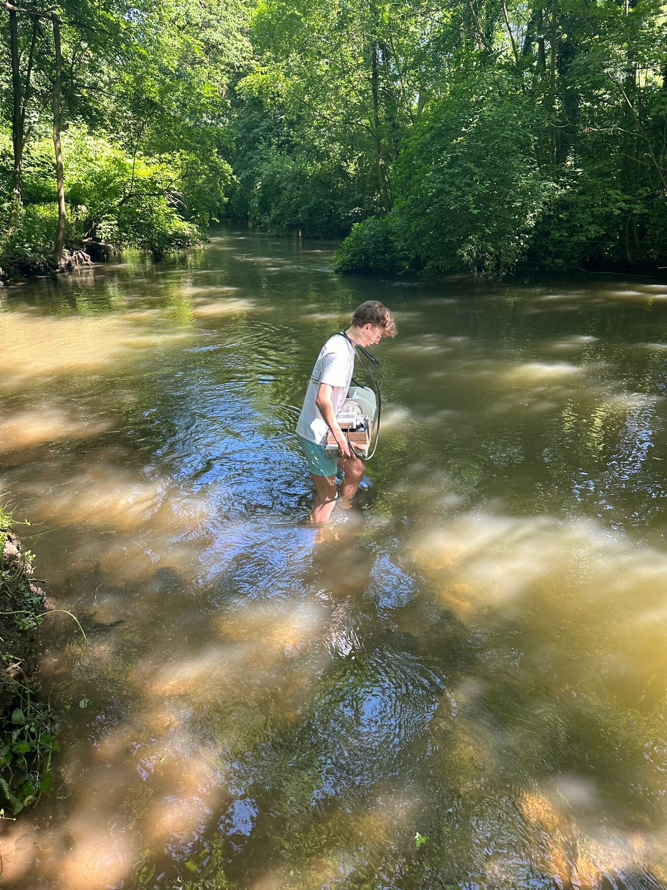
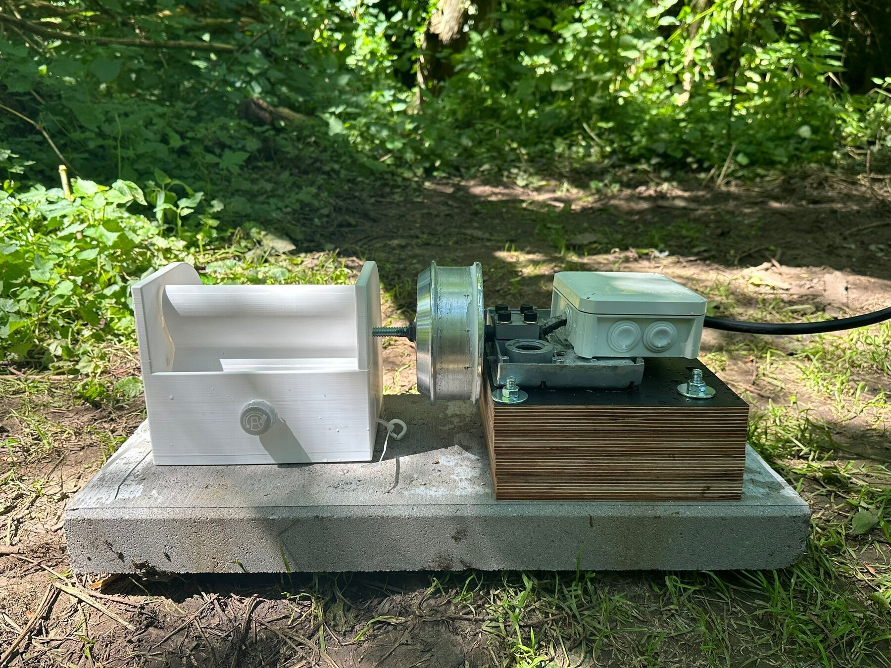
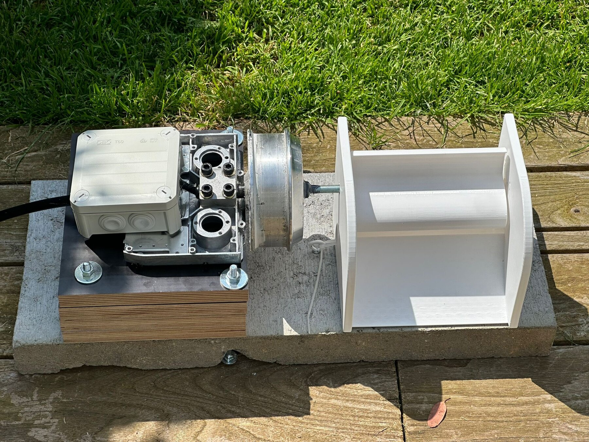
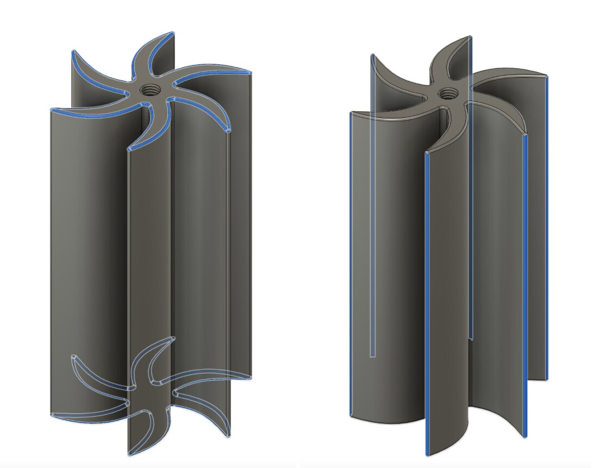
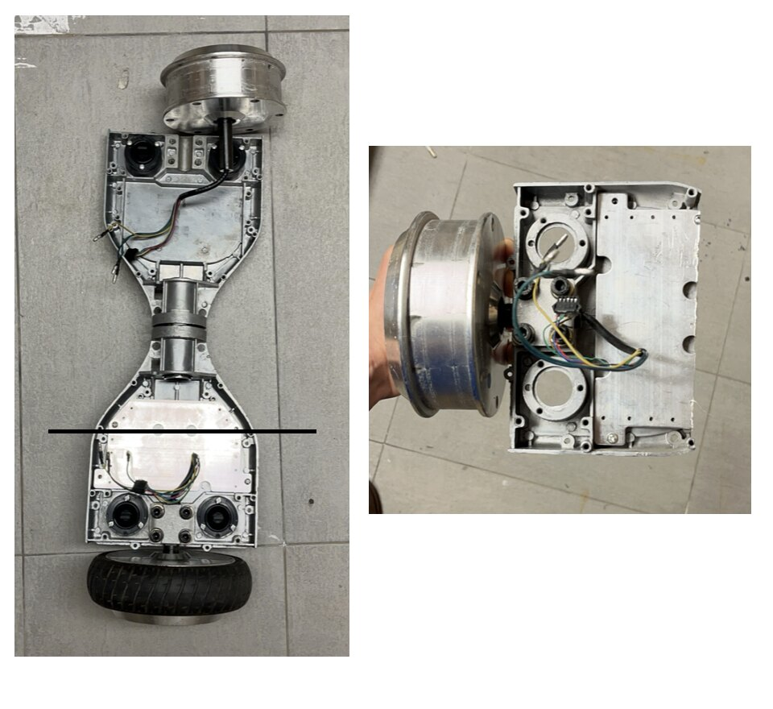
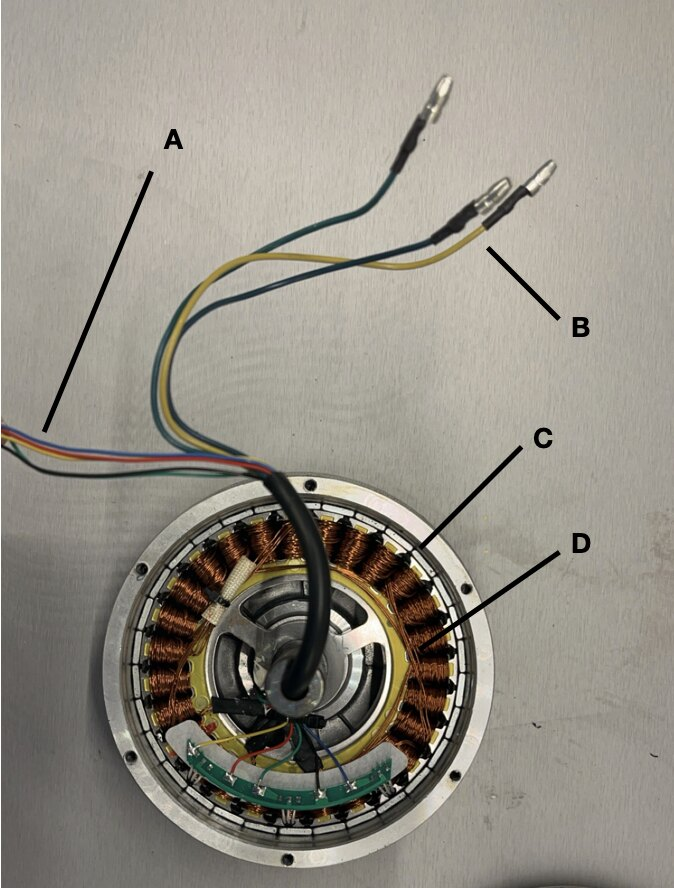
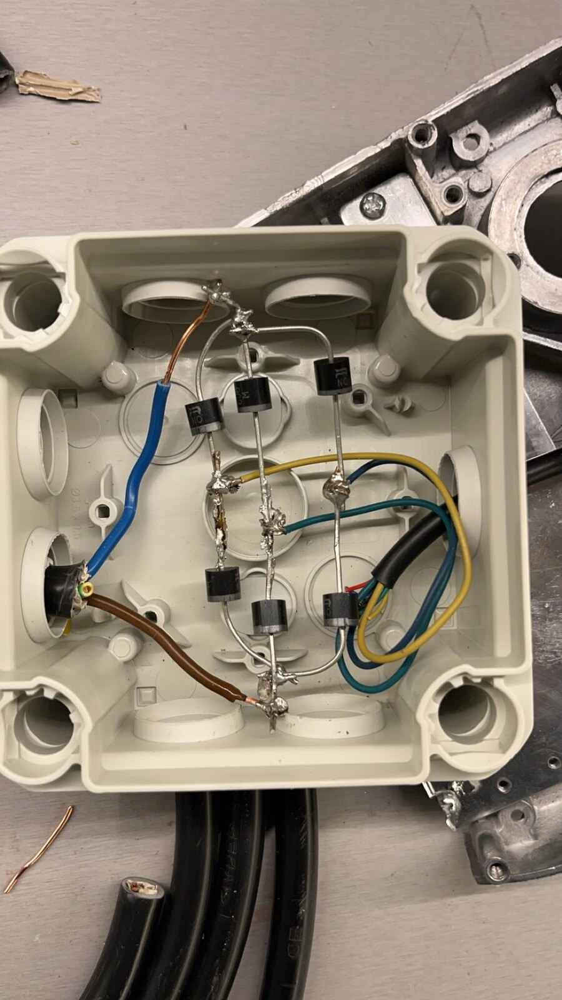
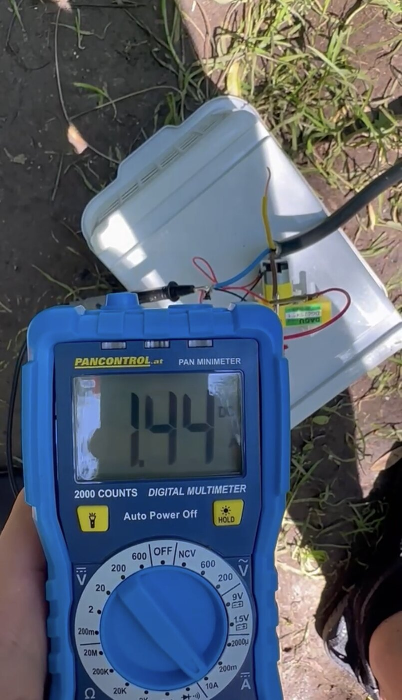

# Hydrokinetic Turbogenerator

This repository documents a run-of-river turbogenerator I designed, built, and field-tested over the course of a year. The core idea was to use 3D-printed vertical-axis turbines to drive a repurposed brushless hub motor acting as a three-phase generator.



**Spoiler alert: it didn't work.** The turbine refused to turn in the river.
But even though this was highly frustrating at first, it taught me some very valuable engineering lessons.

## Context

I originally built this for my *Projektkurs Naturwissenschaften* thesis at Friedrich-Wilhelm-Gymnasium in June 2024, right before I started my mechanical engineering degree at ETH Zürich.

The goal was to see if a small, fully 3D-printable hydrokinetic generator could produce usable power from a standard river current without needing a dam. I wanted to build something that could theoretically be carried out to a remote location to provide off-grid power.

If you read German, you can find my full original report here: [`docs/report-de.pdf`](docs/report-de.pdf).

## What I Built



The setup in the photo above (left to right) includes the 3D-printed turbine housing, the recycled electrical motor generator connected to the turbine using a threaded shaft, the motor mount, and a sealed junction box holding the rectifier.

The entire assembly is anchored to a heavy concrete paving slab, which was a late addition. My original design was way too light and kept getting pushed around by the flowing water. This way it was stable.



### The Turbines

I wanted to test different geometries, so I printed and weighed ten different vertical-axis turbine variants. I designed the main housing around a reversible fit, meaning I could quickly swap out any turbine by the riverside without having to rebuild the entire rig.

I played with three main variables:
- **Blade count:** 3, 4, 5, or 6 blades.
- **Blade shape:** Straight vs. curved.
- **Add-ons:** Guide vanes, higher mass or just plain.

All the variants fit into the same physical envelope (170 mm tall, 86–100 mm in diameter) and weighed between 90 g and 158 g. Unsurprisingly, more blades meant more mass. The variant with guide vanes was the heaviest by far—about 30% heavier than the plain three-blade version—which unfortunately put a significantly higher load on the generator's bearings.



### The Generator & Rectifier

For the generator, I recycled a hoverboard hub motor, stripped it down, and ran it in reverse as a three-phase permanent magnet generator.




To make the three-phase AC output usable, I built a six-diode full bridge rectifier, sealed inside a waterproof junction box.
*(Circuit diagram: [`docs/rectifier-circuit.pdf`](docs/rectifier-circuit.pdf))*



## The Results

At first, things looked promising. When I gave it a good spin by hand, it generated 4.19 V across 3.41 A into a 20 Ω load. That is roughly **14.3 W**. The generator and the rectifier were doing their jobs perfectly.
I then took the setup out to the River Erft in Bergheim. I clocked the flow velocity at **1.468 m/s** (using the highly scientific method of timing a leaf floating down a 10-meter stretch). I sank the rig onto the riverbed so the turbine was about 20 cm below the surface, perfectly perpendicular to the flow.



When I reached under the water and spun it manually, it put out 1.64 V at 1.21 A (about **2.0 W**) and coasted for a second or two before the drag of the generator stopped it completely. The one major win was that the whole assembly stayed completely watertight, which was honestly the part I expected to fail first.

Because the turbine never maintained a steady speed under its own power, I couldn't measure a real power coefficient ($c_p$). If we assume a realistic $c_p \approx 0.1$, my original report projected it should have produced about 2.28 W.

## Why it didn't turn

The kinetic power passing through the turbine's swept area ($A = 0.01439 \text{ m}^2$, $v = 1.468 \text{ m/s}$) is:

$$P = \frac{1}{2}\rho A v^{3} = \frac{1}{2} \cdot 1000 \cdot 0.01439 \cdot 1.468^{3} \approx 22.8 \text{ W}$$

Even if we cap the efficiency at the theoretical Betz limit ($c_p \le 0.593$), there was roughly 13 W physically available to extract.

The real bottleneck was starting torque needed and not just the power available.
I fell into the trap of designing for power and completely ignored the torque required to get the system moving from a dead stop. Two specific mechanisms killed the rotation:

1. **Cogging torque:** A permanent-magnet hub motor has a really strong magnetic detent because the magnets want to align with the stator teeth. The river current has to break that static friction before anything moves and a stationary turbine generates drastically less torque than one that is already spinning.
2. **The diode bridge threshold:** The full bridge rectifier will not conduct until the generated voltage hits about 1.2–1.4 V. Below that speed, the generator is basically acts like a mechanical brake on the shaft without pushing any useful power out. The turbine has to fight its way out of this electrical "dead band" just to start doing work.

A basic power balance told me this project would work. A torque balance at zero speed would have told me it was doomed before I printed anything with the 3D-printer. Learning the critical distinction between a system being power-limited versus torque-limited at startup was my biggest takeaway from this whole endeavor, and it applies to almost any direct-drive machine.

## What I would do differently

If I were to build a version two, here is exactly what I would change:

- **Measure torque first:** I would put the generator on a bench, measure its exact cogging torque and no-load drag, and then size the turbine specifically to overcome that drag at my target flow velocity before committing to a blade geometry. Alternatively, I could reverse the process and select a motor matched to the turbine's output.
- **swap the motor:** Alternatively, I could reverse the process and select a motor matched to the turbine's output. Direct-driving a hoverboard motor designed for 20 km/h with a 1.5 m/s water flow is asking too much. I would either gear the turbine up to the generator, or find a motor with a much lower mechanical resistance.
- **Track RPM:** I only measured voltage and current. Without measuring the shaft's rotational speed, you cannot calculate $c_p$. And without $c_p$, you cannot actually compare how those ten different blade designs performed. I never got to this because the turbines weren't able to spin at all anyway.

## Repository Contents

```text
cad/ 13 STL files — 10 turbine variants, mount, housing shaft, rod
docs/ report (German), rectifier circuit diagram, photographs
